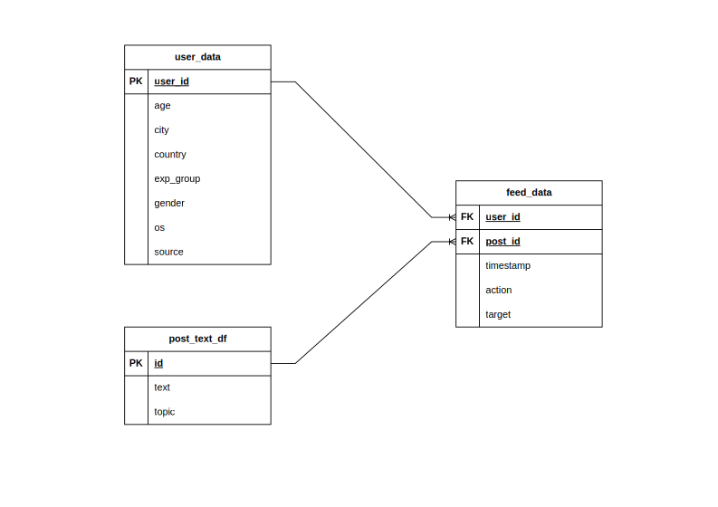

# StartML-FinalProject
Финальный проект курса Start ML от Karpov.Courses.

Данный проект представляет из себя рекомендательный сервис постов в социальной сети.

Ниже представлены сущности, с которыми проводилась работа.



В ходе выполнения проекта были обучены 2 модели:
1) На базе классического ML с использованием TF-IDF, PCA и CatBoostClassifier.
2) На базе глубокого обучения с использованием модели Bert.

Далее было проведено A/B тестирование, которое показало, что модель на базе глубокого обучения явно лучше модели на базе классического ML по таким показателям, как:
* доля пользователей лайкнувших хотя бы один рекомендованный пост,
* количество лайков на пользователя,
* доля рекомендаций, которые понравились пользователям.

Перед запуском сервиса необходимо создать .env файл, в котором будут описаны следующие переменные:

* PG_USER – логин пользователя БД,
* PG_PASS – пароль пользователя БД,
* PG_HOST – хост БД,
* PG_PORT – порт БД,
* PG_DB – название БД.

Запуск сервиса:

```docker compose up -d```

Сервис будет запущен на http://localhost:8000.

Пример запроса:

``` GET http://localhost:8000/post/recommendations/?id=500&time=2021-11-11T15:30:00Z```

В качестве параметров:
* id – идентификатор пользователя,
* time – время запроса рекомендаций.